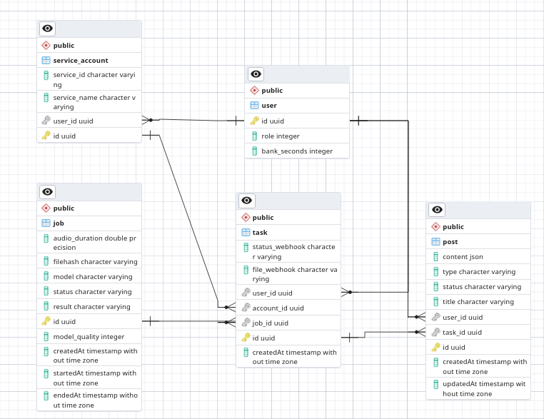

# Astra

#### Данный проект представляет собой платформу для распределённой транскрибизации аудиосообщений на основе Whisper и шумоподавления с применением DTLN модели с обработкой сообщений на основе очереди через Celery, структура представлена из нескольких модулей:
- noise_reduction -- обёртка для этого [репозитория](https://github.com/lhwcv/DTLN_pytorch);
- worker -- модуль для проведения анализа аудио и возврата результата, основан на celery;
- sync -- служит для синхронизации статуса задачи celery в БД, вызывает вебхук при завершении;
- supervizor -- отвечает за добавление задачи в очередь, отслеживание её и получения результата (REST); 
- api -- REST сервер для фронтенда, обращается к supervizor и ловит webhook'и, которые сам создаёт, кроме этого хостит tg бота через webhook'и;
- api.bot -- телеграм бот, который и принимает на вход файлы. Для вывода результата использует WebApp;
- frontend -- WebApp для tg бота, служит редактором транскрибций, выполнен на React.

## Процесс обработки аудио:
1. Отправляете гс, аудиофайл или пересылаете сообщение вашему боту в tg.
2. Бот скачивает аудио, создаёт task для аудиофайла, для него job.
3. Создаётся задача в celery.
4. Один из свободных воркеров забирает задачу и выполняет обработку аудио.
5. После обработки результат добавляется в БД, вызвается вебхук.
6. После вызова вебхука в api, бот возвращает клавиатуру с результатом.
7. С клавиатуры можно скачать результат в txt, srt, либо изменить его или просто просмотреть через webapp.
8. Внесённые изменения сохраняются, при скачивании txt и srt будут включать изменения.

## Структура БД:
